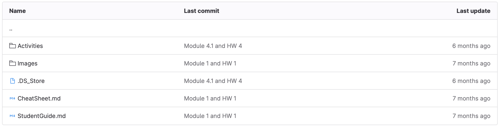

## 1.1 Lesson Plan: The Cybersecurity Mindset

### Overview

In today's class, students will familiarize themselves with the structure of the course and learn about some of the topics that the course will cover. Toward the end of class, students will learn about the CIA triad and complete a group activity. 

Have fun with these activities and be extra encouraging to students today on their first day of class!

### Class Objectives

Students should leave today's class feeling welcome, excited, and ready to begin the rigorous journey ahead. Today they will introduce themselves and complete group activities to set a tone of collaboration and support for the course. 

By the end of class, students will also be able to: 

- Explain the course structure and general direction of the program.

- Recognize the high-level security strategies and tools covered in class.

- Define cybersecurity as the assessment of threats and mitigation of risk.

- Give a clear definition of the CIA triad and its elements.

### Instructor Notes

- First, welcome! And thank you for being a part of our program. Because of instructors and TAs like you, we're helping thousands of students achieve their goals and creative dreams. You've got a long road ahead and plenty of time to make an impact. So buckle in! You're in for a fun ride.

- Today's class is *all* about making the students feel comfortable. This means letting them know, from the start, that you and your TAs are committed to their success. Many of your students will be nervous on the first day, so do what you can to engage with them as friends. Make sure they know that you will support them through the struggles ahead.

- Because of students' nerves, it's very important that you are *extra* prepared for today's class. Practice the presentation at home. Make sure you understand your presentation and feel comfortable with the transitions. Don't repeat the entire lesson from memory, but push yourself to be polished. On the first day, students will be extra aware of your hesitations and will be extra concerned if you seem unprepared. Later, when you've established rapport with your students, you can lighten your preparation a bit. 

- In keeping with the theme of comfort, today's class is also about making sure students are comfortable with *each other*. Many of your students will enter class unsure of what to expect. They might think back to previous learning experiences filled with dull lectures, high-stakes exams, and frequent, nagging feelings of insecurity. It's important they know that this class will be different. As an instructor, your objective is to ensure that the class is a vibrant learning community. 

- Today's class is filled with thought exercises. Do your part as instructors and TAs to ensure that these group activities get students more comfortable with each other and lead to meaningful conversations. Be sure to monitor students' progress through the activities, ask students probing questions, and do your part to keep the environment lighthearted.

- Today's class includes the first slideshow. If you like, modify the slides to your own style, but be sure to cover the key activities. 

  - **Note:** If you decide to modify the slides, you will need to make a copy.  

- Introductions often take a long time. But they are important for establishing the group dynamic. You can adjust today's lesson plan by removing the last activity if you run out of time. 

  -**Note:** During introductions, you or your TA(s) can take short notes about each of your students.  This can be useful for determining the overall skillsets of your students and to get an idea of the goals and interests of the students.

### Preparing for class

Prior to starting class, refer to the following guides for setting up `gitlab` access for your students:

- [Classroom Workflow](../../../00-Teaching-Staff-Prework/Classroom-Workflow.md) 

- Your students should have access to:
  - Student Guide
  - Unsolved Activity Files

### Online Classroom Strategies 

Refer to the following guidelines and best practices for conducting this class online: 

- [Cybersecurity Online Classroom Strategies](../../../00-Teaching-Staff-Prework/OnlineStrategies.md)

### Module Day 1 Contents

- [x] [01. University/SSA/Instructor Do: Introductions](LessonPlan.md#01-universityssainstructor-do-introductions-040)
- [x] [02. Instructor/SSM Do: Begin Slideshow and SSM Introduce CompTIA](LessonPlan.md#02-instructor-do-introduce-comptia-005)
- [x] [03. Instructor Do: The Rising Cyber Threat](LessonPlan.md#03-instructor-do-the-rising-cyber-threat-020)
- [x] [04. Instructor Do: Course Overview](LessonPlan.md#04-instructor-do-course-overview-015)
- [x] [05. Instructor Do: Online Learning](LessonPlan.md#05-instructor-do-online-learning-010)
- [x] [06. Break](LessonPlan.md#06-break-015)  
- [x] [07. Instructor Do: Introduction to First Activity and Breakout Groups](LessonPlan.md#07-instructor-do-introduction-to-first-activity-and-breakout-groups-005)
- [x] [08. Student Do: Assessing Threats](LessonPlan.md#08-student-do-assessing-threats-015)
- [x] [09. Instructor Review: Assessing Threats](LessonPlan.md#09-instructor-review-assessing-threats-015)
- [x] [10. Defining the CIA Triad](LessonPlan.md#10-defining-the-cia-triad-010)
- [x] [11. Student Do: CIA Triad and Security Scenarios](LessonPlan.md#11-student-do-cia-triad-and-security-scenarios-015)
- [x] [12. Instructor Review: CIA Triad and Security Scenarios](LessonPlan.md#12-instructor-review-cia-triad-and-security-scenarios-010)
- [x] [13. Instructor Do: Wrapping Up and Moving Forward](LessonPlan.md#13-instructor-do-wrapping-up-and-moving-forward-005)


### Slideshow 

You can find the lesson slides on Google Drive here: [1.1 Slide Deck](https://docs.google.com/presentation/d/1-9xkWXDfKSQ69jcV8gquziEiJba6yQ2JU3jGEFDynao/edit#slide=id.g27b8a278980_0_1102).

- To add slides to the student-facing repository, download the slides as a PDF by navigating to **File** > **Download as** and choosing **PDF document**. Then, add the PDF file to your class repository along with other necessary files.

- **Note:** Editing access is not available for this document. If you or your students wish to modify the slides, please create a copy by navigating to **File** > **Make a copy**.  

- We recommend you use the slides in the Google Slide web application. Downloading the slides and opening them in PowerPoint may cause formatting errors. 

### Time Tracker

The time tracker is available on Google Drive here: [1.1 Time Tracker](https://docs.google.com/spreadsheets/d/1ZZFXF7FV64lZsZV6qyZ9-0pMz4e-H4rpH_3ds18gDfE/edit?usp=sharing).

### Student Guide

Distribute the student-facing version of the lesson plan: [1.1 Student Guide](StudentGuide.md).


-------

### 01. University/SSA/Instructor Do: Introductions (0:40)
:warning: **Heads Up:** There is a separate slide deck for this Introduction section. Please make a copy of [this template](https://docs.google.com/presentation/d/1dwwF5IfAhYT7-GhDHztgaNM4e5GBGgBp6DEK4nrk5Do/edit#slide=id.gf075916d18_0_0) and follow the instructions on slide 1 for more information about how to utilize the slide deck. 

#### Welcome to the Boot Camp:(0:10)
- Welcome the students to the boot camp. “Welcome to your EdX ( insert University Partner) boot camp!”
- Convey your excitement for the first class and the learning journey that the students will embark on together.
- Provide a high-level overview of the topics that will be covered in the boot camp, highlighting any areas or themes that you’re particularly interested in exploring with students.
- Emphasize that students will learn a lot and have many opportunities to hone a diverse set of skills over the coming months.

##### Instructor Introduction:(0:05)
- Explain that you’ll spend the first part of class on introductions before proceeding onto the lesson material.
- Introduce yourself and share a brief summary of your professional background and teaching experience.
- Optional: Share some details about yourself beyond the scope of the boot camp. Feel free to add personal information, such as your hobbies/interests or career background. If you decide not to offer additional information about yourself, please move forward to team introductions.

#### Team Introduction:(0:05)
- Invite other members of the instructional and student support teams to introduce themselves. 

#### University Partner Introduction:(0:05)
-  If a University Partner representative is present, allow them some time to introduce themselves and welcome the students.
-  If they are NOT present, skip to the learner introductions.

#### Learner Introductions (0:10*) *varied by class size, may exceed timeframe
- Allow learners to introduce themselves. 20 second “elevator speech” including their name, pronouns, favorite food and why they are excited to start class.
- Instead of elevator speech learners can drop a LinkedIn profile link into Slack so they can connect and read about each others’ info.

#### Class expectations (0:05)
- Review general expectations for your classroom. Example: being on camera and participatory, engaging in Q&A, participating in breakout activities, submitting assignments on time, asking for help, utilizing resources, etc.
- Review of resources: The more students understand the resources available to them and utilize them early, the better they are setting themselves up for success
  - Office Hours available before and after each session- used for homework questions, content review ,etc
  - Tutoring: Request help on course material whenever you may need it and receieve 1x1 support.
  - Xpert learning assistants: Accessible via your BCS navigation, this AI Learning Assistant offers instant answers, quizzes on cyber concepts, and invaluable assistance, ensuring you're equipped and prepared for every step of your cybersecurity journey. Demo if time allows. 


[<- Back to Module Contents](LessonPlan.md#module-day-1-contents)

---

### 02. Instructor Do: Introduce CompTIA (0:05)

:warning: **Heads Up:** The rest of the class is on this [1.1 Slide Deck](https://docs.google.com/presentation/d/1-9xkWXDfKSQ69jcV8gquziEiJba6yQ2JU3jGEFDynao/edit#slide=id.g27b8a278980_0_1102). The first slide introduces the CompTIA benefits that are included with the course for the students. 

- Keep track of time and ensure you are staying on schedule. 

- Be concise when you can!

[<- Back to Module Contents](LessonPlan.md#module-day-1-contents)

---

### 03. Instructor Do: The Rising Cyber Threat (0:20)

Now it is time to explore why cybersecurity is such a popular skill today.

- Use the slides to help guide your discussion, pointing out the following:

  - Dependence on IT systems has grown immensely in recent years. 

  - There are more users online, meaning more potential targets. 

  - Cybercriminals are getting increasingly sophisticated and aggressive, and launching attacks with greater audacity.

  - Cybercriminals are getting more organized. 

  - There aren't enough skilled security professionals to fill all the available jobs.

As you discuss these slides, find opportunities to engage students in thoughtful reflection. Encourage students to discuss their opinions and experiences. 

- For example, ask them to share examples of breaches they've learned about in the news.

#### Defining Cybersecurity

:question: **Ask class:** What do you associate with the word "cybersecurity"?

After you've been given a few answers, acknowledge the validity of their responses.

- Using the slides as guidance, explain that cybersecurity isn't really about complicated code and cybercriminals, as it is so often portrayed. 

- Cybersecurity, as we will understand it in this course, is about **assessing threats** and **mitigating risks**. 

Explain that students will have the opportunity to assess threats and mitigate risks in an upcoming thought exercise. First, we are going to provide an overview of the course and the tools we'll use. 

[<- Back to Module Contents](LessonPlan.md#module-day-1-contents)

---

### 04. Instructor Do: Course Overview (0:15)

In this section, we will provide a high-level overview of the course, including the topics covered, technical tools used, projects, and resources provided. 

#### Course Structure 

Explain that students can think of this boot camp as six modules that each focus on an important piece of the vast cybersecurity landscape: 


**Module 1:** Security Fundamentals

- The first two weeks of the program is largely conceptual. This week, students will learn how to think like a security professional, explore the cybersecurity career landscape, and get an introduction to certifications in the space. 

- Next week, we will find out about governance, risk, and compliance. Students will explore security from an organizational perspective via governance, risk, and compliance, and how these topics affect security controls and other decisions.

**Module 2:** System Administration 

- Beginning in Module 3, we will use technical lab environments to complete activities. Students will get comfortable using the command line and will hone their systems administration skills in the several modules that follow. 

- We will cover both Linux and Windows systems, and start programming with both Bash and PowerShell. Students will configure and audit servers, and harden them from malicious attacks.

**Module 3:** Networks and Network Security 

- Security professionals are expected to have a strong foundation in networking. In this module we’ll cover topics such as network configuration, design, ports, protocols, and data communication. 

- We’ll practice analyzing data packets on the wire and investigating network security attacks and hardening, and cover a variety of topics in cryptography. This module will also examine cloud virtualization and security, and you will complete your first project.

**Module 4:** Offensive Security 

- With our networking foundation now established, we’ll explore a variety of offensive topics in security. 

- We’ll start with web architecture and then explore common web vulnerabilities and the hardening techniques associated with them. We’ll then cover ethical hacking and penetration testing, and will use tools like Metasploit.

**Module 5:** Defensive Security  

- We’ll now examine defensive security monitoring and spend a few weeks diving into SIEM with Splunk. We will set up security monitoring, and create alerts, dashboards, and custom reports. 

- Students will gain an understanding of the incident response framework, and learn how to respond to breaches and incidents. We’ll also spend time on forensics, and will use tools to recover deleted data and solve a sample forensics case.

**Module 6:** Review and Final Project 

- At this point, we’ve covered a lot! It’s time for some focused certification and career prep and review. We will focus primarily on the Security+ exam but will also introduce other relevant exams. In the career prep material, we will sharpen our networking skill  and get practice with both behavioral and technical interviewing. 


#### Example Assignments


Using the slides, provide some examples of assignments students will complete during this course. 


- Cybersecurity Policy and Strategy Analysis

- Linux Scavenger Hunt: At the end of module 2, students will work in groups to find a series of flags on a Linux server.

- Networking Capture the Flag: At the end of the Networking modules, students will work in groups to investigate data packets and find a variety of flags that tie to various networking concepts.

- Master of the SOC: At the end of the SIEM modules, students will work in groups to create a custom security operations center and use the monitoring tools they set up to analyze and protect their organization from potential attacks. 


#### Projects 

These modules and assignments will culminate in four projects:

- **Project 1: Securing Cloud Apps:** In the first project week, students will build, secure, and protect a cloud application. You also contribute to the contents of this application by writing your very own cybersecurity blog post!

- **Project 2: Offensive Security CTF:** We'll compete in a three-day CTF in which students will use the skills that they have learned in the Offensive Security module to attack a fictional organization to determine their vulnerabilities.  

- **Project 3: Building a Monitoring Solution:** Students will design a custom monitoring solution for a fictional organization, monitoring the environment during a series of simulated attacks.  

- **Project 4: bootCon:** In the final project, Students will present independently researched projects that demonstrate one of the following: 
  - Exploiting a vulnerability of an IOT device.
  - Developing code or a program that can complete a cybersecurity task.
  - Demonstration of how a cybersecurity tool that was not covered in class can accomplish a specific goal.


#### Tools We'll Use

While the first couple of modules will primarily focus on fundamental cybersecurity concepts, we will quickly shift to applying IT, networking, and cybersecurity skills in technical environments. 

Students will use three kinds of lab solutions throughout this class:

- Web based Labs
- Azure Cloud Lab Services
- Personal Azure Cloud accounts

Next, we'll cover each of these categories in depth. 


#### Web Labs

Starting in Week 3, we will use a web-based lab to complete many tasks associated with systems administration, networking, monitoring, programming, and more. 
 
- Students will be provided access instructions for this web lab before you start Week 3.
  - Point out that there are no installations required to use this lab
      - All that is required is a web browser!


#### Azure Lab Services

We will also use virtual machines to operate the various operating systems and tools throughout the curriculum.

- Explain that we will go into more detail about the use cases of virtual machines (VMs) in the next class.

- For now, explain that virtual machines allow us to run different operating systems. 

- This virtual machine can deployed on the cloud and the user can connect a local computer to that machine.

- These are simple examples, but they demonstrate why we use VMs. Different operating systems provide different capabilities and access to tools.

- Explain that other modules will require the use of multiple virtual machines. 
  - Ask the class if they can think of reasons why we would need to run multiple virtual machines at the same time. 

Examples include: 

  - To practice offensive security, we need an attacking machine and a vulnerable target machine. It would be unethical and most likely illegal to attack actual targets. Therefore, we need to set up target machines to attack. 

  - To set up and monitor alerts during our defensive security modules, we need a machine that is equipped with these monitoring and alerting capabilities and a machine to simulate an attack so we can test the monitors. 

  - To ensure data and resources remain available if a main machine goes offline, we can create multiple machines to use as backups.

Although these lab environments are in the cloud, students will need to download a remote desktop tool to access them, unlike the weblabs. Students will need to register and get set up using provided access credentials. 

- In Module 6, Day 3, students will receive these credentials for their first Azure module, Windows. Instructors will demonstrate how to set up Azure Lab Services.


#### Personal Azure Accounts

During the Cloud Security and Securing Cloud Apps (Project 1) units, students will use personal Azure accounts. Students need these personal accounts in order to deploy secure virtual networks to their own personal cloud environments. We do not allow students to deploy networks to class-owned cloud environments for security reasons.

Students must register themselves for these personal Azure accounts, and will do so in class during Module 11, Day 3. 

| :warning: Personal Azure Account Requirement :warning: |
|:-:|
| When creating a personal Azure account, you will be asked to provide a credit card. While required, you will not be charged any money. You will also be provided $200 credit. Do not sign up for this account or use these credits before you are explicitly prompted to by your instructor.   |


#### Student Resources

Finally, explain that students will have access to many resources for additional learning and review. These include:

- **Student Module Syllabi:** These syllabi will contain weekly overviews of the module. They will set expectations and provide additional support and material for continued learning. 

- **Student Guides:** Student guides are student-facing versions of the lesson plan. Students can use these to follow along with instructor demonstrations and review the content covered in each class.

  - Remind students that the Student Guide is the easiest way to:

    - Access the slide deck for the class. **Note:** If you modify the slide decks for the class, you will need to distribute the link separately from the one in the Student Guide.

    - Access the Activities that will be done in class.

    - Access the Activity Solution files after class.

- **GitLab:**  Explain that the student's set up the GitLab Account as part of the prework for the course.  The GitLab will be where you will upload the Student Guides, Activity Files, and Solutions to Activities.



:stop_sign: Take this time to do a quick check-in with students to make certain everyone has access to these resources.  Remind students that Office Hours are there to assist with getting access.  Emphasize that these resources will be referenced throughout the course, so it is important to have access early.

Ask if students have any questions about the technical infrastructure of the course before moving on.

Make sure to distribute the following to students at the end of this section:

- [Cybersecurity Program Lab Solutions](https://docs.google.com/document/d/1CLKaV4hHYiQOCa1ij0yd_DIRSohANT5pJJ6b0wuxz4c/edit#)

[<- Back to Module Contents](LessonPlan.md#module-day-1-contents)
 
---

### 05. Instructor Do: Online Learning (0:10)

:globe_with_meridians: Take this time to acknowledge the online nature of this boot camp and some of the tools we'll use to facilitate and optimize learning in an online environment. 

Let students know that this class will be collaborative and students will spend plenty of time working together on activities. The course is designed to be a learning community. This first week is about making sure students are comfortable with one another. 

#### Tips for Students
Review the following tips to help your students get the most out of our online classroom:

- **Get to know your classmates and instructors**. You’ll get more out of the course if you perceive yourself as part of a shared community. Social connection can be difficult to develop through a computer screen, but there are ways to get to know your fellow classmates. Participate in class and in your cohort’s Slack space (more on Slack coming up). You don’t have to get too personal, but you can share your security interests and career goals.

- **Treat class time like you would a live class**. If you were sitting in a classroom, there would not be many potential distractions around you. Likewise, you should make the physical area where you sign in to class as free of distractions as possible. If you can, go to a quiet room, turn on silent mode on your phone, and ask others in your home to avoid distracting you while you’re online.

- **Budget time for classwork**. In an online environment, it can be harder to keep track of due dates for assignments. Deliberately scheduling time throughout the week for your coursework will help. Set aside three hours, three to four times a week, for studying and completing Challenge assignments. Your work won’t be overwhelming this way, and you won’t be working on assignments at the last minute!

Next, introduce some of the tools and strategies you’ll be using in this class to optimize the experience.

#### Zoom Online Best Practices

Assure students that it’s okay if they are not familiar with using Zoom in a classroom environment and that you will model good Zoom behaviors throughout the program.

Send the following link that highlights Zoom features like hand-raising, polling, screensharing, and breakout rooms.

- [Zoom Features](https://trilogyed.wistia.com/medias/tpycnx2e34)

Cover several recommended best practices:

**Instructor Note:** If you like, you can add to the list of best practices. Remember to update slides if you do.

- **Always mute your microphone**. If you are not speaking, mute your microphone.

- **Set your first and last name**. Help everyone get to know you by using your full name as your screen name. Remind students to check the name on Zoom each time they log in.  Many students are using shared accounts.  Also, remind students that the TAs will be taking attendance based on Zoom, so the name is important to get credit for class.

- **Keep your video on**. Be present during the online class. This includes showing your face. Remind students that it is understandable that things come up and they may need to go off camera, but it is important to keep your camera on as much as possible to be a part of the shared community.

- **Raise your hand or use Slack for questions**. Don't interrupt a lecture. Use the hand raise feature in Zoom, or ask the question via Slack.

  - Remind students that you and a TA will answer questions after or during the lecture when appropriate.

  - **Instructor Note:** If a question comes through that is outside the scope of the class, you can let the student know that it can be addressed during office hours, or that it is covered in a later class.

  - **Instructor Note:** Remember to check your Slack channel and Zoom hand raise feature regularly to see and respond to students' questions.

    - If you have a TA, they can monitor the channels and either respond in Slack or bring it to the attention of the instructor.  In larger classes, it can be a challenge to lecture and constantly monitor the questions.

- **Use headphones with microphones**. Background noise and feedback echoes can be an issue for some when using your computer mic and speakers. Use headphones with a microphone to improve sound quality and clarity when speaking.


#### Slack

Explain that Slack is an online communication tool that is like a forum, instant messenger, and email all rolled into one. It's used by countless organizations worldwide, and you'll be using it every single day for the next six months.

- We will use Slack to send code snippets during class, share important announcements, and facilitate group exercises. 

- Students should have received the link to their class-specific channel during orientation. Though there is a Slack web application, for this course everyone should have the program installed on their machine.

:stop_sign: **Instructor Note:**  If a student indicates that they have not set up Slack, remind the student to address this during Office Hours.

#### Bringing Engagement to the Online Classroom

Explain that throughout class, we’ll use techniques to add engagement. Cover some of the techniques listed below:

- The instructor will not be the only person speaking! During demos and reviews of activities, we’ll pause to ask questions. 

- Students should submit questions via the appropriate Slack channels. Instructional staff will make sure to cover as many of them as possible at the end of a section.

- We will use **breakout rooms** regularly throughout the course, starting with a group activity after the break.

- We recommend **checking comprehension with class polls** throughout class. At a minimum, do this at the end of every activity review. Class polls provide students with an opportunity to *anonymously* indicate their level of understanding of the previous activity. This icon indicates the poll feature: :bar_chart:

  - Both [Zoom](https://support.zoom.us/hc/en-us/articles/213756303-Polling-for-meetings) and [Slack](https://slack.com/help/articles/229002507-Create-a-poll-) provide a poll feature. 
  
  - Use these features to conduct comprehension checks and evaluate how well students understand concepts covered in activities. 

  - Polls can be as simple as the following: 

    ```
    How comfortable are you with <topic>?

    A. It was easy. I am ready to move on. 

    B. It was challenging, but I understood and completed it. 

    C. It was too challenging. I wasn't able to complete it. 

    ```

  - Students who indicate low comprehension should seek out help from the instructional staff during Office Hours.   

For more information and instructions on conducting class in an online environment, refer to this document: 

  - [Online Class Guide](../../../00-Teaching-Staff-Prework/OnlineStrategies.md)

Ask if students have any questions before our break. Explain that after the break, we will begin the first lesson and activity. 

[<- Back to Module Contents](LessonPlan.md#module-day-1-contents)

---

### 06. Break (0:15)

[<- Back to Module Contents](LessonPlan.md#module-day-1-contents)

---

### 07. Instructor Do: Introduction to First Activity and Breakout Groups (0:05) 

Explain that in this activity, students will start to think like cybersecurity professionals. 

- Remind them of the main tasks of cybersecurity: assessing threats and mitigating risks. 

- These two tasks often require creativity and outside-the-box thinking.

:globe_with_meridians: This activity will use **breakout groups**. 

- For this activity, divide students into groups of 4&ndash;6 (Depending on class size) and send them to their breakout rooms. 

  - **Instructor Note:** Encourage students to remember which breakout room number they were in and to choose a spokesperson during the last 30 seconds before returning to the main room.  

  - Remind students that different rooms will be called on after the activity

- :warning: **Heads Up:** Keep one group in the main room to preserve the class recording. 

- For more instructions on how to set up breakout rooms, and more information about online procedures, refer to this link: 
    
  - [Online Class Guide](../../../00-Teaching-Staff-Prework/OnlineStrategies.md)

- We will get faster at this down the road but getting set up in the first breakout room might take some time. 
 
Give students a little time to get into the activity. Then, you and the TAs can move around the breakout rooms to see how it's going and help students.

Also explain that for each activity, students will access an "activity file" on GitLab or in the Student Guide that will provide the instructions. 

[<- Back to Module Contents](LessonPlan.md#module-day-1-contents)

---

### 08. Student Do: Assessing Threats (0:15)

Explain the following: 

- To an experienced cybersecurity professional, threats exist everywhere, even in the most common technologies. 

- In this activity, you will work in groups to evaluate the potential threats posed by various technologies. 

Assign students to their breakout rooms and send them the following file: 

- [Activity File: Assessing Threats](Activities/09_Assessing_Threats/Readme.md)

[<- Back to Module Contents](LessonPlan.md#module-day-1-contents)

---

### 09. Instructor Review: Assessing Threats (0:15)

Spend this time asking different groups to share their answers.  

When reviewing, include specific instances of real-life application of these example threat assessments.

- For example, during a penetration test, a company might purchase 25&ndash;50 of these USB drives and drop them in random spots at the target organization's locations. When someone picks one up and plugs it into a computer, it creates a connection and gives remote access to that computer. 
  - Ask if anyone can explain what a penetration test is.

- For larger classes (40+) you can also use the Zoom Whiteboard feature to record the answers from other breakout rooms

[<- Back to Module Contents](LessonPlan.md#module-day-1-contents)

---

### 10. Instructor Do: Defining the CIA Triad (0:10)

Explain that we will now move on to our first cybersecurity concept: the **CIA triad**. 

The CIA triad highlights the three cornerstones of information security: **confidentiality**, **integrity**, and **availability**.

:question: **Ask class:** Define the three key terms in your own words: What is confidentiality? What is integrity? What is availability?

Using the slides as a scaffold, discuss the defining characteristics of the CIA triad:

- **Confidentiality:** The state of keeping or being kept secret or private.

  - This corner of the CIA triad is all about ensuring sensitive information does not reach unauthorized people.

  - Some examples of confidentiality attacks include uploading private photos or communications onto a forum or exposing credit card numbers online.

  - Confidentiality comes down to the principle of "need to know": Data or information should only be made available to those who need access to it.

  - Confidentiality is supported or enforced through various other measures, like encryption, authentication, etc.

- **Integrity:** The quality of being honest, whole, or undivided.

  - The integrity of information refers to protecting information from being modified by unauthorized people.

  - Some examples of integrity attacks include intercepting money transfers and changing the amount in seemingly insignificant ways, allowing for the excess to be sent elsewhere; or altering the grades at a university to be better or worse.

  - These kinds of attacks can be prevented by using a secure hashing algorithm and process when transferring data to ensure it isn't tampered with in transit.

- **Availability:** The quality of being able to be used or obtained.

  - Availability concerns occur when operating systems, equipment, and data are not functioning correctly and thus are not accessible by those who need it.

  - Some examples of an availability attack include cybercriminals taking down a web-connected generator to disable a critical power supply or using a denial-of-service (DoS) attack to bring down a financial service provider's website, making it impossible for clients to make transactions.

  - Creating regular backups of data is one way to maintain availability.

Emphasize that cybersecurity is concerned with the confidentiality, privacy, and integrity of data and data systems.

- We will revisit these terms regularly throughout the program and will explain how the various topics, skills, and practices are concerned with protecting confidentiality, privacy, and integrity.

[<- Back to Module Contents](LessonPlan.md#module-day-1-contents)

---

### 11. Student Do: CIA Triad and Security Scenarios (0:15)

- In this activity, students will analyze a variety of brief security scenarios and identify which element of the CIA triad (confidentiality, availability, or integrity) each situation is concerned with.

:globe_with_meridians: Assign students new groups of 4&ndash;6 (depending on size of class) and move them into breakout rooms. 

- :warning: **Heads Up:** Keep one group in the main room to preserve the class recording. 

- For more instructions on how to set up breakout rooms, and more information about online procedures, refer to this link: 
    
  - [Online Class Guide](../../../00-Teaching-Staff-Prework/OnlineStrategies.md)

Send the following activity file: 

- [Activity File: CIA Triad and Security Scenarios](Activities/12_CIATriad/Unsolved/Readme.md)

[<- Back to Module Contents](LessonPlan.md#module-day-1-contents)

---

### 12. Instructor Review: CIA Triad and Security Scenarios (0:10)

:bar_chart: Using [Zoom's](https://support.zoom.us/hc/en-us/articles/213756303-Polling-for-meetings) or [Slack's](https://slack.com/help/articles/229002507-Create-a-poll-) poll feature, conduct a comprehension check and evaluate how well students completed the activity. 

Use the solution guide to review the answers. Move between groups and have them share their answers and thoughts. 

If a group provides an incorrect answer, before saying it is wrong, ask the class if they agree with the answer the group provided. Why or why not? Then, have another group provide the correct answer. 

Remind students that solutions files will be uploaded to Gitlab at the end of each class.

- [Solution Guide: CIA Triad and Security Scenarios](Activities/12_CIATriad/Solved/Readme.md)

[<- Back to Module Contents](LessonPlan.md#module-day-1-contents)

---

### 13. Instructor Do: Wrapping Up and Moving Forward (0:05)

Congratulate students on completing the first day of this boot camp! The pace will pick up quickly, and soon they will complete assignments and projects that showcase a completely new set of skills and comprehension.

Make sure to distribute the student-facing version of the lesson plan: 

- [1.1 Student Guide](StudentGuide.md)

- These students guides are available for every single class. You should also provide the slide link to students. 

- Depending on your preference, distribute these resources to students before or after class.

#### Moving Forward

Explain that next class, we will do a deeper exploration of assessing risk and mitigating threats by evaluating specific attacks and vulnerabilities of users, web applications, servers and databases.  

- Further ahead, in the final day of this module we will examine cybersecurity domains, career pathways, and certifications. 

[<- Back to Module Contents](LessonPlan.md#module-day-1-contents)

----

© 2023 edX Boot Camps LLC. Confidential and Proprietary. All Rights Reserved.    
