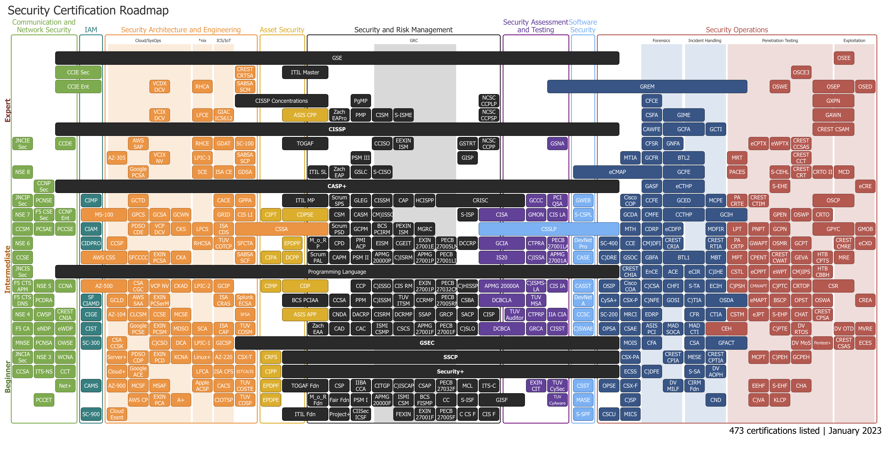

## 1.3 Lesson Plan: Surveying the Cyberspace 

### Overview

Today's class focuses on professional pathways. Students will get an overview of cybersecurity certifications, domains, and professions, and an in-depth review of the Security+ exam.  

### Class Objectives

By the end of class, students will be able to:

- Consider roles and career pathways within the cybersecurity space.

- Explain the landscape of certifications available to security professionals.

- Explore what the Security+ exam is and which InfoSec pathways benefit from the certification.


### Instructor Notes

- This class, especially the domain and career-oriented sections, will ask students to think about their desired career goals and areas of interest. It is completely fine if students do not have a specific career pathway that they're interested in. This boot camp will present a wide scope of cybersecurity skills and domains, allowing students to narrow down what interests and motivates them. 

- Use any opportunity to provide personal experiences and examples from your own career.  

### Instructor Note

At the end of class, you will conduct a fireside chat, which will provide the students with an opportunity to hear about the careers and backgrounds of you and the TA, as well as advice on how to succeed in the class and in the cyber industry. Be sure to let the TA know they will be participating in this activity as well.


### Online Classroom Strategies 

Refer to the following guidelines and best practices for conducting this class online: 

- [Cybersecurity Online Classroom Strategies](../../../00-Teaching-Staff-Prework/OnlineStrategies.md)

### Module Day 3 Contents

- [x] [01. Instructor Do: Welcome and Today's Themes](LessonPlan.md#01-instructor-do-welcome-and-todays-themes-005)
- [x] [02. Instructor Do: Quick Review](LessonPlan.md#02-instructor-do-quick-review-010)
- [x] [03. Instructor Do: Cybersecurity Domains](LessonPlan.md#03-instructor-do-cybersecurity-domains-015)
- [x] [04. Student Do: Cybersecurity Careers Research](LessonPlan.md#04-student-do-cybersecurity-careers-research-015)
- [x] [05. Facilitated Discussion: Cybersecurity Careers Research](LessonPlan.md#05-facilitated-discussion-cybersecurity-careers-research-020)
- [x] [06. Instructor Do: Using Our Career Services Department](LessonPlan.md#06-instructor-do-using-our-career-services-department-010)
- [x] [07. Break](LessonPlan.md#07-break-015)
- [x] [08. Instructor Do: Cybersecurity Certifications](LessonPlan.md#08-instructor-do-cybersecurity-certifications-020)
- [x] [09. Instructor Do: Introduction to Security+ Certification](LessonPlan.md#09-instructor-do-introduction-to-security-certification-015)
- [x] [10. Instructor Do: Introduction to Security+ Certification Exam](LessonPlan.md#10-instructor-do-introduction-to-security-certification-exam-015)
- [x] [11. Instructor Do: Challenge Introduction](LessonPlan.md#11-instructor-do-challenge-introduction-015)
- [x] [12. Instructor and TAs Do: Fireside Chat](LessonPlan.md#12-instructor-and-tas-do-fireside-chat-remainder-of-class)
- [x] [13. Instructor Do: Wrap-Up](LessonPlan.md#13-instructor-do-wrap-up-005)

### Slideshow

The lesson slides are available on Google Drive here: [1.3 Slides](https://docs.google.com/presentation/d/1GFBGw2LPGeQzkWymJAN_SwPfkbmEsabIJQQNP_Cr6TA/edit?usp=sharing).

- To add slides to the student-facing repository, download the slides as a PDF by navigating to **File** > **Download as** and choosing **PDF document**. Then, add the PDF file to your class repository along with other necessary files.

- **Note:** Editing access is not available for this document. If you or your students wish to modify the slides, please create a copy by navigating to **File** > **Make a copy**. 

### Time Tracker

The time tracker is available on Google Drive here: [1.3 Time Tracker](https://docs.google.com/spreadsheets/d/1ZZFXF7FV64lZsZV6qyZ9-0pMz4e-H4rpH_3ds18gDfE/edit#gid=1047115118).

### Student Guide

Distribute the student-facing version of the lesson plan: [1.3 Student Guide](StudentGuide.md).

---

### 01. Instructor Do: Welcome and Today's Themes (0:05)

Welcome students to the third day of class. We've only just scratched the surface of cybersecurity, but we have covered *a lot*. Today, we'll continue to expand this scope by examining various cybersecurity domains, careers, and certifications. 

- Explain that students shouldn't feel pressured to know exactly what career path they want to pursue after this boot camp. Once students are exposed to the various skills, concepts, and domains covered in the various units of this course, they will have a better idea. For now, we'll start by discussing the high-level domains that exist in the cybersecurity industry. 

- Students will also have an opportunity to search various job platforms to get a sense of the current cybersecurity hiring landscape. 

- Next, we'll cover certifications. We will specifically go over the Security+ certification and answer a few practice questions. 

- Finally, at the end of class, you will conduct a fireside chat, which will provide the students with an opportunity to hear about the careers and backgrounds of you and the TA, as well as advice on how to succeed in the class and in the cyber industry. 

Before we dive in, let's review some concepts we covered over the past two days. 

[<- Back to Module Contents](LessonPlan.md#module-day-3-contents)

---

### 02. Instructor Do: Quick Review (0:10)

Using the slideshow as a guide, review and discuss the topics from the previous lesson:

- Discuss how nearly every single node of a web application&mdash;the webpage, server, database, and even the users and administrators&mdash;can be targeted by a cybercriminal. 

- Then, find out if students can name some different kinds of attacks that cybercriminals use to target these nodes.

- Cover some of the primary methods used by cybersecurity professionals to prevent cybercriminals from compromising an application or its users.

[<- Back to Module Contents](LessonPlan.md#module-day-3-contents)

---

### 03. Instructor Do: Cybersecurity Domains (0:15)

Start this section with a quote about entering the cybersecurity field from Tao Security's Richard Bejtlich:

- _Providing advice on “getting started in digital security” is similar to providing advice on “getting started in medicine.” If you ask a neurosurgeon he or she may propose some sort of experiment with dead frog legs and batteries. If you ask a dermatologist you might get advice on protection from the sun whenever you go outside. Asking a “security person” will likewise result in many different responses, depending on the individual’s background and tastes._ [Source: TaoSecurity](https://taosecurity.blogspot.com/2017/03/cybersecurity-domains-mind-map.html)

Explain to the class that the field of cybersecurity is so vast that it is often hard to get straightforward advice on how to enter the industry. This is because the advice of each professional will vary depending on their background and tastes.

- Add specific examples around this if you can.

Point out that the cyber domains map in the slides shows various cybersecurity domains and roles, and discuss some of these domains. You are welcome to modify or add to these descriptions with your own professional experiences and examples. Students want to hear about your perspective, and specific examples will add more depth to these descriptions.

- **Security architecture:** A unified security design that addresses the necessities and potential risks involved in a certain scenario or environment. It also specifies when and where to apply security controls. The design process is generally reproducible. ([Source](https://www.oreilly.com/library/view/effective-cybersecurity-a/9780134772929/))

- **Security operations:** The process that identifies critical information to determine if friendly actions can be observed by enemy intelligence and if information obtained by adversaries could be useful to them, and then executes selected measures that eliminate or reduce adversary exploitation of friendly critical information. ([Source](https://fas.org/irp/doddir/dod/jp3_13_3.pdf))

- **Governance:** The framework for managing performance and risk, oversight of compliance and control responsibilities, and defining the cyber mission by mapping the structure, authority, and processes to create an effective program. ([Source](https://bluelance.com/cybersecurity-governance))

- **Physical security:** The protection of personnel, hardware, software, networks, and data from physical actions and events that could cause serious loss or damage to an enterprise, agency, or institution. This includes protection from fire, flood, natural disasters, burglary, theft, vandalism, and terrorism. ([Source](https://books.google.com/books/about/HIMSS_Dictionary_of_Healthcare_Informati.html?id=AEowBQAAQBAJ))

- **Threat intelligence:** Evidence-based knowledge, including context, mechanisms, indicators, implications, and actionable advice, about an existing or emerging threat to assets, which can be used to inform decisions about responding to that threat. ([Source](https://www.gartner.com/en/documents/2487216/definition-threat-intelligence))

- **Career development:** Training of future cybersecurity professionals.

- **Risk assessment:** Analyzing what can go wrong, how likely it is to happen, what the potential consequences are, and how tolerable the identified risk is.

- **User education:** Teaching users how to protect themselves from cyberattacks by informing them of risks, exploits, and external threats, as well as teaching them the skills needed to combat common attacks.

- **Frameworks and standards:** The creation of new security frameworks and practices for professionals to follow. 

- **Supervisory Control and Data Acquisition (SCADA):** Protecting and securing large-scale infrastructure components (like the electric grid, water treatment systems, and factories) from cyberattacks.

Our program is primarily concerned with the technical aspects of cybersecurity, but we will connect these areas to the overall security organization and business.

- We'll dive deep into security operations and security architecture in this course. We'll also explore penetration testing and discuss red team vs. blue team in depth.

- Governance and risk assessment are two of the main topics we'll cover next week. We'll also discuss the importance of user education and training. We'll discuss physical security tools like key cards, and the implementation of disaster recovery planning.

- Throughout this course, we will discuss different frameworks and standards. It is important to understand how these affect the development and priorities of a security organization. It's also important to note that different industries follow different frameworks, which we'll discuss next week. 

Ask students if they have any questions before proceeding.

[<- Back to Module Contents](LessonPlan.md#module-day-3-contents)

---

### 04. Student Do: Cybersecurity Careers Research (0:15)

Explain the following to students:

- In the next activity, we'll explore security careers and pathways in depth.

- We'll start by conducting some career research.

Send students the following activity file: 

- [Activity File: Cybersecurity Careers Research](Activities/04_Careers/Readme.md)

[<- Back to Module Contents](LessonPlan.md#module-day-3-contents)

---

### 05. Facilitated Discussion: Cybersecurity Careers Research (0:20)

:bar_chart: Using [Zoom's](https://support.zoom.us/hc/en-us/articles/213756303-Polling-for-meetings) or [Slack's](https://slack.com/help/articles/229002507-Create-a-poll-) poll feature, conduct a comprehension check and evaluate how well students completed the activity. 


Begin by asking students to share answers to the above questions on search terms, job descriptions, and skills and qualifications. Mention the following points, either throughout this discussion or after it:

It's important for you to assess your existing skills and job level:
 
- Are you a career switcher or starter? Are you entering the security field for the first time? 

- If you have existing experience, what is it? Possibilities include:
  - Technical cybersecurity adjacent fields, such as IT and networking
  - Technical experience, such as software development
  - Security experience, such as security operations center (SOC) operations, security analysis, and security risk analysis and policy

Similar job titles can have different skills and qualifications, so it's important to review the specifics of a job description. 

- You'll notice that many jobs, such as security analyst, don't necessarily expect candidates to have a lot of specific skills and tools. Many companies are open to teaching employees on the job. What's important is showing your passion, ability, and willingness to learn. 

- Passion and ability to learn is key. This program will push you past your comfort zone, but *learning how to learn* is a critical skill that employers search for. 

  - Also, always stay curious and keep up to date on cybersecurity news and trends. Complete projects and participate in activities like CTFs (Capture the Flag competitions). In interviews, you should be able to discuss and demonstrate your passion and how you learn. 

- **Instructor Note:** This is a good place to share relevant resources that you use to maintain your skills.

- Do not be deterred by jobs that require a few more years of experience than what you have. If you are just starting out, a job that requires six to eight years of experience is most likely not a possibility, but a job that requires two years of experience is often possible. 

  - Employers will often intentionally put more years of experience than is actually needed in order to avoid too many applicants. 

Share the following statistics:

- According to [the US Bureau of Labor Statistics](https://www.bls.gov/ooh/computer-and-information-technology/information-security-analysts.htm), there will be a 35% growth in employment for Information Security Analysts between the years 2021 and 2031. 

- The 2022 State of Cybersecurity report by [ISACA](./Resources/State-of-Cybersecurity-2022_WHPSC22_res_eng_0322.pdf) states:

  - 63% of respondent enterprises have unfilled cybersecurity positions.
  - 60% of enterprises report experiencing difficulties in retaining qualified cybersecurity professionals.  
  - 82% of respondents believe that leadership sees value in conducting cyber-risk assessments (but only 41% perform annual assessments).

 
- Also, according to [ISC2](https://www.isc2.org/Insights/2023/11/ISC2-Cybersecurity-Workforce-Study-Looking-Deeper-into-the-Workforce-Gap?queryID=389b9de4d6af04b8a045c6bcdcc4a64c) (2018), 87% of all cybersecurity professionals started their careers in a different field. This means that the majority of cybersecurity professionals have backgrounds similar to your students.

Transition to a discussion of career pathways and explain that, while it’s possible to jump between levels, in general the cybersecurity industry wants candidates with proven experience when hiring. If you’re new to the field, you will need to put in work to get started.

- However, it's important to note that because of the increased demand for security professionals, you can probably skip some of the years of required experience for certain jobs. We have had complete beginners in our program get jobs as network administrators, SOC analysts, and security analysts after completing the program. 

- Point out that we'll now discuss common job titles and where they fit in different pathways.

  - **IT support specialists**, **computer help desk specialists**, and other similar titles are entry level jobs for all cybersecurity domains. 
    
  - **Systems administrator** and **network administrator** jobs are also entry level jobs in the networking space. 
    
      - Technical cybersecurity roles require a strong foundation in networking, which our program covers. We also provide relevant cybersecurity context to our networking modules, so they are still relevant for those who already have sysadmin or networking experience. These roles are within reach for career switchers and starters.
    
      - Networking roles focus on configuring and maintaining networks, and often include security related tasks, such as monitoring logs, implementing firewalls, and maintaining network-based backups. 

  - A range of entry level security jobs focus on the operations and the defensive side of security. Our program will equip you with the skills to be hired in these roles, like many of our graduates.
  
    - **SOC analysts** are the most common entry-level security jobs. Specifically, Tier 1 SOC analysts can be hired with no prior professional experience. They work at a SOC within an organization, monitoring and analyzing network traffic. 
      - They are the first level of defense and are responsible for monitoring the security of users, systems, and the network. They detect and investigate suspicious and potentially malicious activity on the network and within systems.
  
    - **Security or information specialists/analysts** encompass different skill levels and responsibilities, so it is important to always review the job description, specific skills, and qualifications. These roles actively protect an organization from security threats and breaches. 
      - Common responsibilities for entry level roles include keeping up to date with security improvements, monitoring and protecting security systems, implementing security tools and protocols, developing security requirements, analyzing security policies and protocols for weaknesses and flaws, and designing and developing training. 
  
    - **Information assurance technicians** protect computer assets by establishing and documenting access and maintaining files.
  
    - **Forensics specialists** come in after a crime has been committed. They analyze logs and other data to determine what occurred. 
      - Some common responsibilities include conducting security incident investigations, recovering and examining data from computers and other devices, compiling evidence for legal cases, writing technical reports, preparing evidence for trial, and working with law enforcement on the validity and preservation of data. 
    
    - **Risk analysts** use their knowledge and experience to examine systems and procedures to identify potential adverse events, including hardware and software crashes, physical disasters, malicious intruders, malware, denial of service (DoS) attacks, and employee misconduct. 
    
    - **IT auditors** are responsible for the internal controls and risks to a company’s technology network. This role includes identifying the weaknesses in a system's network and creating an action plan to prevent security breaches in the technology.

  - Typically, with some years of experience in the above roles, people can move on to mid- to advanced-level roles (such as the ones that follow). Many mid- and advanced-level roles may also require additional certifications. 
    
    - **Security engineers** test the network for vulnerabilities, monitor for security breaches, and develop security plans and policies. 
      - Common responsibilities include installing and configuring firewalls and intrusion detection systems; performing vulnerability testing and security assessments; evaluating new technologies; testing existing security solutions; and defining, implementing, and maintaining security policies. 
      
      - Many of these responsibilities are similar to those of a security analyst but are more advanced and often more technical.
    
    - **Penetration testers** or **ethical hackers** are often hired by a company to test and break into their security controls and defenses and identify and report vulnerabilities and flaws in a system, using specific tools to simulate cyberattacks. 
      - Their goal is to help companies improve their security posture. Pentesters need to deeply understand the types of systems they’re trying to break into. They usually specialize in specific systems, such as networks, web applications, or mobile applications. 

  - **Chief information officers (CIO)** and **chief information security officers (CISO)** are advanced managerial roles in cybersecurity. Certifications such as CISSP+ are often required.

  - Explain that the cybersecurity landscape is constantly changing, and new jobs are regularly being created (i.e., integrating artificial intelligence and machine learning into cyber).

[<- Back to Module Contents](LessonPlan.md#module-day-3-contents)

---

### 06. Instructor Do: Using Our Career Services Department (0:10) 

Explain that the Career Services department is available for students from the first day of the program.

- During class, you will tie concepts and skills in with career outcomes and roles. The Career Services team will help you do the practical, hard work of obtaining a new role or promotion.

- There are several career milestones for you to complete that you'll find in Canvas.

  - You can access them all now and submit milestones whenever you want during the program.

  - However, you will need to submit at least one milestone in order to unlock Career Services.

  - One of the milestones, an updated, polished resume, will be a requirement in one of our later Challenge assignments, but you can submit this earlier if you'd like.

  - Review the slides on Becoming Employer Competitive, Working with Your Profile Coach, and Working with Your Career Director.

- Let students know that this week's Challenge will contain more details on Career Services. If students do not know who their Career Director is, they should reach out to their Student Success Manager.

[<- Back to Module Contents](LessonPlan.md#module-day-3-contents)

---

### 07. Break (0:15)

[<- Back to Module Contents](LessonPlan.md#module-day-3-contents)

---

### 08. Instructor Do: Cybersecurity Certifications (0:20)

Explain that as the demand for cybersecurity careers grows, employers frequently use certification as a measure of employee qualifications and training when hiring.

- Emphasize that if students are serious about advancing their careers in security, certifications will be an important step toward more opportunity, knowledge, and skills.  Certifications can be used across jobs and organizations.

- Note that it is possible to get an entry-level security job without any certifications. For example, an SOC analyst is a common job that often does not require any certifications. For career starters, many networking jobs, such as systems or network administrators, also do not require certifications. 

:question: **Ask class:** Pose a few questions to the class to gauge their knowledge of and interest in certifications:

- Which certifications do you know about?

- Which certifications are you interested in pursuing?


Explain that certifications are obtained through accrediting organizations. Here is a list of top providers, with a few of the certifications they offer:


- **CompTIA:** Security+, PenTest+
- **GIAC:** GPEN, GCIH
- **ISC2:** CISSP, SSCP
- **Offensive Security:** OSCP, OSWP
- **EC Council:** CEH, ECIH

Most of these organizations offer both introductory certifications and more advanced specialization certifications.

 - As of early 2023, there are over 400 security certifications available to cybersecurity professionals. 

 - Explain to the class that while this number is huge, many are specific to vendors or industries.  Others focus on government or industry compliance.  

  - Share the following list of certifications over Slack or Chat and remind students that all the links are in the student guides:
  
    - [Wikipedia: Computer Security Certifications](https://en.wikipedia.org/wiki/List_of_computer_security_certifications)

- Share [Paul Jerimy's Security Certification Roadmap](https://pauljerimy.com/security-certification-roadmap/) with the class.

- Explain how this map breaks down Cybersecurity into broad groups (Security Operations, Communications, etc.) across the top, and by difficulty (Beginner to Expert) horizontally on the left.  

- Point out how the Security+ spans multiple areas of interest.

- Note how clicking on any of the certifications will take you to the homepage for that certification.



- Explain that students can refer back to this tool as they explore their career interests throughout the class.


Have students spend a few minutes reviewing the list. Point out that it identifies certification details related to specific criteria, such as issuing organization, focus, cost, and more. Also, point out how many specializations and associated certifications exist within cybersecurity.

- Inform students that today's class will focus only on the Security+ exam. Additionally, point out that many of the topics in this course will help prepare them for this exam. 

[<- Back to Module Contents](LessonPlan.md#module-day-3-contents)

---

### 09. Instructor Do: Introduction to Security+ Certification (0:15)

Emphasize that while this class explores the importance of cybersecurity certifications, this course is *not* a test prep course. This course will offer an exam voucher and practice resources for the Security+ exam, but to be properly prepared to take the exam, students will have to learn other topics and practice extensively on their own. 

Review the following questions about the CompTIA Security+ certification:

#### What is the Security+ certification?

* According to CompTIA: "Security+ is the first security certification IT professionals should earn. It establishes the core knowledge required of any cybersecurity role and provides a springboard to intermediate-level cybersecurity jobs. Security+ incorporates best practices in hands-on troubleshooting to ensure security professionals have practical security problem-solving skills. Cybersecurity professionals with Security+ know how to address security incidents—not just identify them."

#### What are some jobs that may require the Security+ certification?

   - Security architect
   
   - Security engineer
   
   - Security consultant
   
   - Security specialist
   
   - Information security analyst

Explain that as of January 2024, the average annual pay for an information security analyst in the US was $96,652 per year. ([Source](https://www.ziprecruiter.com/Salaries/Information-Security-Analyst-Salary))

#### What skills and knowledge areas are assessed in this certification?

Note the following domains covered in the exam:
  
  - Threats, attacks, and vulnerabilities
  
  - Technologies and tools
  
  - Architecture and design
  
  - Identity and access management
  
  - Risk management
  

Explain that we will cover many aspects of these topics throughout the program. Throughout the course, we will emphasize which topics and skills covered in class are also relevant to the Security+ exam.

- Emphasize that students will still need to study topics in depth outside of class to prepare for the certification.

#### At which point in my career should I consider taking the Security+ exam?

- Security+ is considered an entry level exam. The skills that you learn in this program will provide a foundation that you can build on to prepare for the exam. 

- In class, we will do lots of practical work and go in-depth into several topics, but the Security+ exam is broader and requires knowledge in areas that we do not cover in this program.

- For these gaps, you will get access to a question-based tool called CertMaster Practice, which will provide the necessary coverage needed to master the exam. 

#### Why are all the topics in the Sec+ exam not covered in our program? 

**Again, this boot camp is not a test prep course.** 

- We don't cover every topic discussed in the Security+ exam because our program focuses on providing hands-on experience with the most common concepts, tools, and technologies used in security and networking.

- What the course _does_ cover provides you with knowledge that will be relevant to almost any security job you'll apply to, as well as a framework that makes it easy to learn new protocols and tools when you encounter them in your studies and work.

- Some topics on the Security+ exam are left out because they are highly specific and relevant either only to the test or to specific subfields of cybersecurity. As such, they contribute little to foundational, general knowledge. 

    - For example, the TACACS+ protocol appears on the Security+ exam, but only engineers who work specifically with Cisco devices use it.

- These topics are left out so you can spend the majority of the course learning the tools and concepts that will prepare you to succeed in the _largest number of jobs_, and to learn any networking/security concepts you encounter.

Ask the class if they have any questions about the certification before you begin discussing the exam.

[<- Back to Module Contents](LessonPlan.md#module-day-3-contents)

---

### 10. Instructor Do: Introduction to Security+ Certification Exam  (0:15)

Cover the following details about the exam: 

- The test consists of 90 multiple-choice and performance-based questions.

- Test takers will have 90 minutes to complete the exam. 

- The passing score is 750 (on a scale of 100&ndash;900).

- The cost of the exam is $404.00, but all students will receive a free exam voucher at the end of the program. 


Breakdown of the domains by percent:

```
Domain                               | Weight||  
==================================================
Attacks, Threats and Vulnerabilities | (24%) ||
Architecture and Design              | (21%) ||
Implementation                       | (25%) ||
Operations and Incident Response     | (16%) ||
Governance, Risk and Compliance      | (14%) ||


Total                                |100%   ||     
```

- **Instructor Note:** Explain to students that you will go into more detail about the types of questions on the test in a later module.

[<- Back to Module Contents](LessonPlan.md#module-day-3-contents)

---

### 11. Instructor Do: Challenge Introduction (0:15)

Explain that this week's Challenge has three parts:

1. Students are required to complete prework prior to the program. Students should consider submitting the prework for the first part of this week's Challenge.

2. Following our discussion on career roles and pathways, students should write a brief summary of their current skills and what they would like to do after this program. Details are provided in the Challenge file.

3. Most security professionals use prominent reports, blogs, and papers to stay up to date on the field. Since this is such a critical skill, this week's Challenge has students review three prominent security reports in order to get a basic understanding of the market.

This assignment is a bit report-heavy, due to how important both research and reporting are to the work of a cybersecurity professional. Because of this, students will be given a series of worksheets to fill out while navigating the papers. 

If there are questions about due dates, have students consult Canvas.

[<- Back to Module Contents](LessonPlan.md#module-day-3-contents)

---

### 12. Instructor and TAs Do: Fireside Chat (Remainder of Class)

For the remainder of class, spend some time discussing the ways in which you all entered into the industry. Let students ask questions and build up their confidence as best as you can.

- Feel free to adjust the chat as you see fit, but below are some suggested questions:

  - What tips would you give the students to succeed in the next 24 weeks?
  - What is your formal title and what do you actually do all day?
  - What were your first cybersecurity jobs?
  - It can be hard to get your first opportunity in the field. How does someone prove that they have the skills and that they know what it takes and have the knowledge? (I.e., web and data science candidates can use portfolios; how do we do that with cyber?)
  - A lot of folks are transitioning into a new field. How can people successfully transition from their past experience to their aspirations in cybersecurity?
  - What are the most important skills you can learn in your first cybersecurity job?
  - When hiring, what do you look for in candidates?
  - How do you see the cybersecurity space changing in the next 1&ndash;3 years? Next 5 years?

[<- Back to Module Contents](LessonPlan.md#module-day-3-contents)

---

### 13. Instructor Do: Wrap-Up (0:05) 

If students feel overwhelmed by the amount of information covered, assure them that they will become familiar with these concepts throughout the course. After they receive the CertMaster Practice tool, they will have a full year of access to the platform and can self-study topics at their own pace.

- While we did not do a deep dive into the other domains, emphasize that we will briefly discuss them throughout the modules in this program, and we will help students understand what to study for each. 

Remember to upload the [1.3 Student Guide](StudentGuide.md) and advise students to review it and go over concepts they need more time with. 

Answer any students' questions before ending class. 

[<- Back to Module Contents](LessonPlan.md#module-day-3-contents)


---

2023 edX Boot Camps LLC. Confidential and Proprietary. All Rights Reserved.
