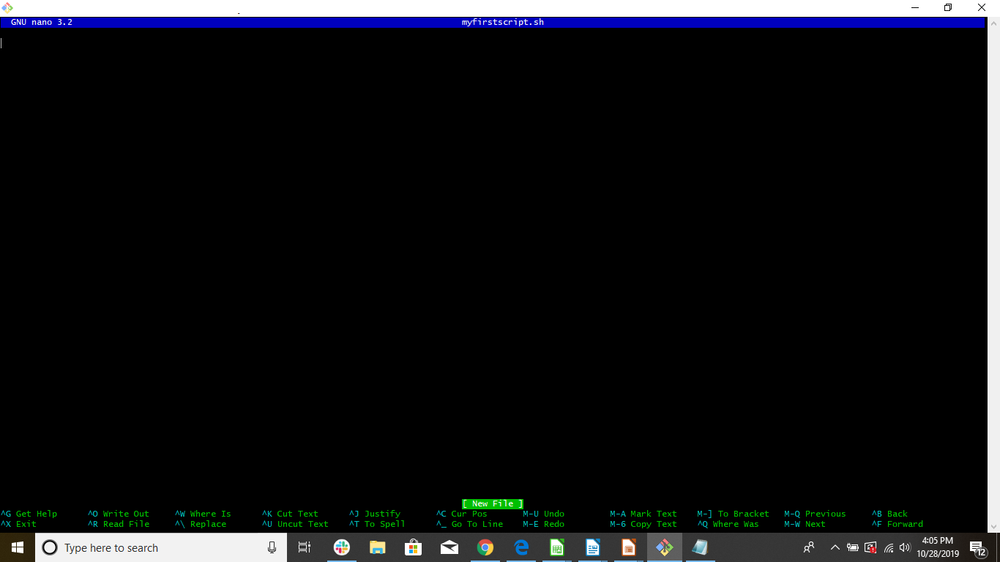
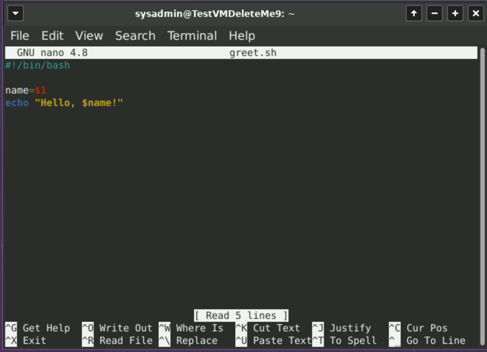

## 3.3 Student Guide: Stick to the Script

### Overview

In today's class, you will further develop your command-line skills by learning how to use text processing and text editing to develop your own `cd log_directory` command-line script.

### Class Objectives

By the end of this class, you will be able to:

* Define three benefits of text processing programs over programming languages for a security professional.

* Use `sed` to make substitutions to a file.

* Use `awk` to isolate data points from a complex log file.

* Edit contents of a file using `nano`.

* Design an IP lookup shell script by passing arguments.

### Module Day 3 Contents

- [x] [01. Class Introduction](StudentGuide.md#01-class-introduction)
- [x] [02. Activity:  Warm-up](StudentGuide.md#02-activity-warm-up)
- [x] [03. Intro to Text Processing](StudentGuide.md#03-introduction-to-text-processing)
- [x] [04. Intro to sed](StudentGuide.md#04-introduction-to-sed)
- [x] [05. Activity:  Use sed](StudentGuide.md#05-activity-use-sed)
- [x] [06. Activitiy Review: Use sed Activity](StudentGuide.md#06-activity-review-use-sed)
- [x] [07. Intro to awk](StudentGuide.md#07-introduction-to-awk)
- [x] [08. Activity:  Use awk](StudentGuide.md#08-activity-use-awk)
- [x] [09. Activitiy Review: Use awk Activity](StudentGuide.md#09-activity-review-use-awk)
- [x] [10. Break](StudentGuide.md#10-break)
- [x] [11. Intro to Shell Scripting](StudentGuide.md#11-introduction-to-shell-scripting)
- [x] [12. Write and Edit Files](StudentGuide.md#12-write-and-edit-files)
- [x] [13. Activity:  My First Shell Script](StudentGuide.md#13-activity-my-first-shell-script)
- [x] [14. Activitiy Review: My First Shell Script Activity](StudentGuide.md#14-activity-review-my-first-shell-script)
- [x] [15. Passing Arguments](StudentGuide.md#15-passing-arguments)
- [x] [16. Activity:  Build an IP Lookup Tool](StudentGuide.md#16-activity-build-an-ip-lookup-tool)
- [x] [17. Activitiy Review: Build an IP Lookup Tool Activity](StudentGuide.md#17-activity-review-build-an-ip-lookup-tool)

### Slideshow

- The lesson slides are available on Google Drive here: [3.3 Slides](https://docs.google.com/presentation/d/1XOtj00EaMRikW2-BQv_DD9uTjTiFkS-qK0ykMSJnBqA/edit#slide=id.gfc2777889c_0_1203).

- **Note:** Editing access is not available for this document. If you wish to modify the slides, please create a copy by navigating to File > "Make a copy..."

-------

### 01. Class Introduction

Before diving into the next set of commands, let's review what we've covered so far.

**Command Options and Man Pages**

- Commands can have their default behavior modified using **options**.

- Command options can have their own arguments called **parameters**.

- **Man pages** are documentation that exists within the terminal containing command syntax, options, and parameters.

- `man` followed by a command will display the documentation for that specific command.

**Searching for Directories, Files, and Data Within Files**

- The `find` command is used to find directories or files:

  - `-type d` is the option and parameter for finding directories.

  - `-type f` is the option and parameter for finding a file.

- The `grep` command is used to find a data point within a file.

- **Wildcards**, indicated with a `*`, can assist `grep` and `find` by:

     - Searching through multiple files. For example: `*.txt`.

     - Searching for part of a data point. For example: `*login*`.

**Counting Data and Piping**

- The `wc` command can be used for counting files, lines, and words.

- Pipes, which are indicated by `|`, are used to combine multiple commands.

- Pipes take the output from the command on the left and apply it to the new command on the right.

[<- Back to Module Contents](StudentGuide.md#module-day-3-contents)

---

### 02. Activity: Warm-up

- [Activity File: Warm-up](Activities/02_warmup/unsolved/readme.md)

- [Directories/Files: Warm-up](Resources/warmup.zip)

- [Solution Guide: Warm-up](Activities/02_warmup/solved/readme.md)

[<- Back to Module Contents](StudentGuide.md#module-day-3-contents)

---

### 03. Introduction to Text Processing

Security professionals often face the following challenges:

 - They work with many forms of data such as application logs, server logs, server files, configuration files, and raw code.

 - Many of these forms of data are complex, large, and difficult to analyze in their raw form.

    For example, take a look at the following web server log file:

 

- These complex data files can be difficult for anyone to analyze.

- Embedded within these complex and large files are **data points** that can help security analysts research **security incidents**, such as:

    - Dates;

    - Usernames; and

    - Phone numbers.

- These data points can help security professionals to:

  - **Isolate attack signatures:** For example, an attacker might use a specific username to launch their attack. Finding this data point will assist with isolating out the username tied to an attacker.

  - **Identify attack vectors:** For example, an attacker might launch an attack through a field on a login page. Finding this data point will assist with identifying the field being used for the attack.

  - **Identify the timing of attacks:** For example, an attacker might launch their attack at exactly midnight every night. Finding this data point can help isolate the timing of the attack.

We have to take these large and complex files and isolate the data points that are needed to complete tasks. This can be accomplished with **text processing commands**.

#### Text Processing Commands

**Text processing commands** are command languages used to manipulate text and simplify complex data.

  - Text processing commands have many capabilities to simplify working with complex data, such as:

    - Substituting text;

    - Filtering lines of text; and

    - Delimiting text.

  - Multiple text processing commands are already built into the terminal, such as `cut`, `awk`, and `sed`.

**Note:** There are other command languages that can also manipulate text, such as Python and C++. These are designed for programming, such as for running web applications.

Text processing provides the following three benefits over programming languages:

 - **Simplicity:** Text processing is simpler and easier to learn than programming languages.

 - **Convenience:** Most text processing commands are pre-installed in terminals, unlike many programming languages.

 - **Compatibility:** Text processing commands can easily be added together to complete more advanced tasks. This is much more challenging to do with programming languages.

This lesson focuses on two powerful text processing utilities: `awk` and `sed`.  

[<- Back to Module Contents](StudentGuide.md#module-day-3-contents)

---

### 04. Introduction to sed

We just covered how security professionals spend a lot of time working with complex log files. One source of added time and complication is the need to analyze and consolidate complex data from different sources.

- For example:

    - You need to analyze login activities across two different applications.

    - One application labels logins as "LOGGED IN" while the other labels them as "ACCESS ACCEPTED."

    - The challenge is to replace all the strings of `ACCESS ACCEPTED` with `LOGGED IN` so that the data is consistent when analyzing the datasets together.

We can use the text processing command `sed` to accomplish this task.

  - `sed` stands for "**s**tream **ed**itor."

  - This means that it reads and edits text, line by line, from an input stream.

  - An **input stream** is a string of all characters in a text file.

  - It's called a **stream** because `sed` reads the file from top to bottom, line by line, and only reads each line once.

In other words, `sed` is a utility that works from the command line to modify text using an easy and compact coding language.

- While `sed` has multiple capabilities, we'll focus on the most basic `sed` capability: **string replacement**.

#### Using sed for String Replacement

**Note:** String replacement is synonymous with string substitution, similar to the Windows "find and replace" feature.

Let's walk through a simple `sed` command to create a basic string replacement.

  - We will be doing the following string replacement:

     `The Dog Chased the Ball` will become ` The Dog Chased the Cat`. 

  - We will accomplish this by using `sed` to replace `Ball` with `Cat`.    

#### sed Demonstration

1. Access the `/03-instructor/day3/sed_demonstration/` directory:

    -  `cd /03-instructor/day3/sed_demonstration/`

2. Within this directory is a file called `sed.txt`.

3. Show the contents of the file by running  `cat sed.txt`.

      - This displays the only line in the file:   

        - `The Dog Chased the Ball`

4. Next, use `sed` to replace the word "Ball" with "Cat":

    -   `cat sed.txt | sed s/Ball/Cat/`

      - The syntax is:

        `cat (file name) (pipe) sed s/(old value)/(replacement value)/`

5. Run the command. It replaces the word `Ball` with `Cat` with the following result:

   - `The Dog Chased the Cat`

#### Demonstration Summary

We covered the following concepts:

  - `sed` is a text processing utility that can assist security professionals with analyzing data.

  - The most basic `sed` capability is **string replacement**. This can increase consistency across separate data sources, which can assist in research.

  - The basic syntax of string replacement is `sed s/(old value)/(replacement value)/`.

[<- Back to Module Contents](StudentGuide.md#module-day-3-contents)

---

### 05. Activity: Use sed

- [Activity File: Use sed](Activities/05_sed_activity/unsolved/readme.md)

- [Directories/Files: Use sed](Resources/learning_sed.zip)

[<- Back to Module Contents](StudentGuide.md#module-day-3-contents)

---

### 06. Activity Review: Use sed

- [Solution Guide: Use sed](Activities/05_sed_activity/solved/readme.md)

[<- Back to Module Contents](StudentGuide.md#module-day-3-contents)

---

### 07. Introduction to awk

When working with data, you'll often need to obtain specific data points within complex log files.

- For example:

  - You have a log file that contains city, state, and country fields separated by commas. However, for our analysis, we only need the **states** from the log file.

  - In other words, our log record contains records like "Atlanta, Georgia, USA," but we only need "Georgia."

We can technically use `sed` to perform the task with the following command:

   `sed 's/^.*\(,.*,\).*$/\1/' | sed 's/,//g'`

- While `sed` can technically perform this task, it is a complicated set of code that takes time to compose.  

Fortunately, there is another text processing tool called `awk` that allows us to perform this task more efficiently.

 - Like `sed`, `awk` is designed for text processing, but is primarily used for data extraction and reporting from streams of text.

 - `awk` can separate out fields in a stream of text and isolate the specific fields needed.

Let's isolate the state field from the above example by using `awk`.

#### awk Simple Demonstration

1. Access the `/03-instructor/day3/awk_demonstration/` directory:

    -  `cd /03-instructor/day3/awk_demonstration/`

2. Within this directory is a file called `awk.txt`.

3. Show the contents of the file by running `cat awk.txt`.

    - This displays the only line in the file:   

      - `Atlanta, Georgia, USA`

4. To use `awk` to only display the state, Georgia, we will run the following:        

    -   `awk -F, '{print $2}' awk.txt`

   -  The syntax: `awk -F(delimiter) '{print $(field_number)}'`  

      - `awk`: Indicator telling your operating system to run the `awk` command

      - `-F,`: Option for doing field separation with `awk`

          - The value that comes right after `-F` is the parameter signifying how the file separates out the data points. In the example, the parameter is a comma (`,`).

          - This parameter is also known as the **delimiter**.

          - **Note:** The parameter needs to come directly after the `-F`, with no spaces.

       - `{print  $2}'`: Indicates `awk` is printing the second field, after the fields have been separated by a comma

          - The `$` is included before the number to indicate the field.  

         - Multiple fields can be added, with a comma between each.

         - The required format must have single quotes (`''`) and curly brackets (`{}`) around the print function.

5. Run the command.

    - We were able to separate out `Atlanta, Georgia, USA` by commas using `awk` and only print out the second field, which contained the value `Georgia`.

    - This is a much simpler set of code than what was required by `sed`.

This was a very basic example, and security professionals often need to isolate multiple fields from complex log files. Now, let's do another more challenging demonstration to illustrate how `awk` can be used to assist with a security incident.

#### awk Demonstration for a Security Incident

In this scenario, you are security analysts at ACME Corp, which has just experienced an attack of a high volume of network requests. You have been provided the logs of these network requests.

You are tasked with isolating the IP addresses and time of requests from these logs to determine which IP address is appearing most frequently. This IP likely belongs to the attacker.

1. Access the `/03-instructor/day3/awk_demonstration/` directory. Run:

    `cd /03-instructor/day3/awk_demonstration/`.

2. Preview the log file, called `access_logs`. Run:

    `more access_logs`              

3.  Next, analyze the data of the log file to determine how to build your `awk` command.

    -  Note each of the items below on the log file:

        - The fields are separated out by spaces, so a space will be used as a field separator.

        - When you separate out the fields by spaces, time is in the second field, so you need to print out the second field first.

        - The IP address is in the first field, so you need to print this field after time.

5. Type the following `awk` command to see how this will be accomplished:

      `awk -F" " '{print $2, $1}' access_logs`

   - The first part of the `awk` syntax (after the pipe): `awk -F" "`

     - This instructs the operating system to run the `awk` command of field separation.

     - In this example, one space is the delimiter.

        To indicate that you want to separate the fields by spaces, place once space between two double quotes (`" "`).

   - The second part of the `awk` syntax: `{print $2, $1}`

      - This command will print out the second and first fields in that order.  

6. Run the command and notice how `awk` is able to take a complex log file and parse it out to show only the fields needed: time and IP address.

    -  In this result, the top reoccurring IP, `41.33.233.87`, is easy to detect. This is likely the IP address of the attacker.

    - Identifying an IP address of an attacker can assist a security professional with determining what IP address should be blocked from the network to prevent future attacks.

 #### awk Summary  

 Let's recap the following concepts:

  - `awk` is a text processing utility like `sed`, but it is more robust, as it can separate out fields with simple code.

  - `awk` can assist security professionals by isolating specific data points, like IP addresses, to assist with determining what IP addresses should be blocked.

  - The basic syntax of field separation with `awk`:  

    `awk -F(delimiter)  '{print $(field_number)}' `  

[<- Back to Module Contents](StudentGuide.md#module-day-3-contents)

---

### 08. Activity: Use awk

- [Activity File: Use awk](Activities/08_awk_activity/unsolved/readme.md)

[<- Back to Module Contents](StudentGuide.md#module-day-3-contents)

---

### 09. Activity Review: Use awk

- [Solution Guide: Use awk](Activities/08_awk_activity/solved/readme.md)

[<- Back to Module Contents](StudentGuide.md#module-day-3-contents)

---

### 10. Break

[<- Back to Module Contents](StudentGuide.md#module-day-3-contents)

---

### 11. Introduction to Shell Scripting

IT and security professionals are required to complete security tasks that involve multiple subsequent commands.

  - For example, we might be tasked with cleaning up space in a directory because log files are taking up too much space.

  - To complete these tasks, we need to run the following  three separate commands, in order:

    1. `cd` to navigate to the directory containing log files

    2. `zip` to compress the files

       - `zip` commands will be covered in more detail in a future lesson.

    3. `mv` to move the new zip file into an archive folder

Rather than run each of these activities separately, we can **script** them together, which allows the commands to be run in order using a single command.

Writing scripts, or **scripting**,  provides the following benefits to IT and security professionals:

   - Running multiple commands with a single script can improve the **speed** of accomplishing tasks.

   - Having a single script that runs multiple commands can improve the **consistency** of task results.

   - Scripts can be provided to other users for **reusability**, meaning the same tasks can be completed by someone unfamiliar with the individual commands necessary to complete them.

In the terminal, we'll focus on a specific type of scripting known as **shell scripting**.

  - **Shell** is a terminal program that assists in the interaction between the user and terminal.

     - There are many shells available in the terminal, such as `sh`, `bash`, `zsh`, and `csh`.

  - Shell scripting is a way of using these shell programs to automate tasks in the form of a collection of commands.

How shell scripts are designed:

   - For the above example, a single shell script could be called `diskcleanup.sh`.

     - The `.sh` is a required extension to make the shell script executable.

   - Within `diskcleanup.sh` are the three commands in the order they need to be run, from the top down, one line per command:

      -  `cd log_directory`  

       -  `zip logs* logfiles.zip`  

       -  `mv logfiles.zip ./archive_directory`

   - To execute the shell script, run this single command:

     `sh diskcleanup.sh`

   - Running that single command executes all three commands inside the script in order.

However, before we start writing our own scripts, we need to learn how to write into a file to add in our commands.   

[<- Back to Module Contents](StudentGuide.md#module-day-3-contents)

---

### 12. Write and Edit Files

**Text editors** are efficient tools used to create and edit files with data inside them.

- Text editors can be run from the terminal or desktop environments, depending on the editor.

- IT and security professionals can use text editors to build scripts and create documentation, reports or files of any type.

- You are probably familiar with a type of text editor: Notepad in Windows.

- Common text editors available within the terminal are `nano`, `vi`, `vim`, and `emacs`.

- Text editors can be used to create new files or edit existing files.

Let's complete a file editing demonstration with the text editor `nano`, as this is the simplest one to learn and available on most terminals.

Use nano to create a simple shell script that contains the two following commands:

   - `mkdir new_directory`

   - `cd new_directory`

#### Building a Shell Script Demonstration

1.  Create a `nano_demonstration` directory:

    `mkdir nano_demonstration`

2. Access the `/03-instructor/day3/nano_demonstration/ directory`:

    `cd nano_demonstration`         

2. To create a new script called `myfirstscript.sh` with nano,  run:

    `nano myfirstscript.sh`

   - The syntax is simply:

      `nano <new file name>`

-   If the file already exists, it will take you to edit that existing file.

4.  Run the command `nano myfirstscript.sh` and see that this takes you to an editing window within the terminal.

    

     This program is similar to Notepad in Windows, where we can edit the file as needed.

6.  Type the first command on the first line:

      `mkdir scripts`

7. Enter the second command on the second line:

      `mv myfirstscript.sh scripts`

8. Next, save the changes in this file. Save the nano file using Ctrl+X, then press Y and keep the file name.

   It will confirm the name of the file: `myfirstscript.sh`.

      - Press Enter to keep this file name.

   This created a shell script file called `myfirstscript.sh`.

11. In order to run this new shell script, run the following command:

      `sh myfirstscript.sh`

    - This command made a directory called `new_directory` and placed your script file into it.

13. Run the `ls new_directory/` command to confirm this took place.

 #### File Writing and Editing Summary  

  - **Text editors** are command-line utilities that are used to create or edit plain text files.

  - Nano is an easy-to-use text editor that is available in most terminals and is good for creating shell scripts.

[<- Back to Module Contents](StudentGuide.md#module-day-3-contents)

---

### 13. Activity: My First Shell Script

- [Activity File: My First Shell Script](Activities/13_shell_scripting/unsolved/readme.md)

- [Directories/Files: My First Shell Script](Resources/first_shell_script.zip)

[<- Back to Module Contents](StudentGuide.md#module-day-3-contents)

---

### 14. Activity Review: My First Shell Script

- [Solution Guide: My First Shell Script](Activities/13_shell_scripting/solved/readme.md)

[<- Back to Module Contents](StudentGuide.md#module-day-3-contents)

---

### 15. Passing Arguments

The script we just created will run the exact same process each time it is executed. However, there may be times we'll need to change a single value in a script.

- For example, a security analyst may need to run the cleanup shell script we just created, but only need it to zip up a certain file date.

  - If we need to zip up files named `logs0519`, we need to change one command in the script:

    `zip logs* logfiles.zip`  

    to

    `zip logs0519 logfiles.zip`   

- Rather than manually edit the script to make this change each time the script is run, we can add a **passing argument**.

#### Passing a Single Argument

How to pass a single argument in a shell script:

  - You can add an argument to pass into a script by placing the argument after the script name.

    - For the above example, we can run:

      `sh diskcleanup.sh 0519`

    - The syntax is: `sh shellscript Argument1`.

  - To pass the `0519` into the script, add a `$1` indicating where the first argument, `0519`, will be passed.

      - We change:

          `zip logs* logfiles.zip`

          to

        `zip logs$1 logfiles.zip`  

      - This way, when the script `sh diskcleanup.sh 0519` runs, the command will be changed to:

        `zip logs0519 logfiles.zip`

#### Adding Multiple Arguments   

  - Additional arguments can be added with the following syntax:

    `sh shellscript Argument1 Argument2 Argument3`

    - For example:

       `sh diskcleanup.sh 0519 backupfolder`

  - Within the script, the arguments are represented by:   

       - Argument1 = `$1`

       - Argument2 = `$2`

       - Argument3 = `$3`
   
#### Passing Arguments Demonstration

In this demo, you will create a simple script called `greet.sh` that will take a person's name as an argument and display a greeting message.

1. Navigate to `/03-instructor/day3/`.

2. Create a `passing_variables` directory:

    - `mkdir passing_variables`

3. Navigate to this new directory:

    - `cd passing_variables`

4. Create your new script:

    - `nano greet.sh`

5. For your first line of your new script write:

    - `#!/bin/bash`

6. Then add the following two lines:

    - `name=$1`

    - `echo "Hello, $name!"`

  - This sets the first variable `name` to whatever you enter when you run the script

  

7. Save the script and exit nano.

8. Make the script executable:

    -`chmod 777 greet.sh`

9. Run the script with any name after the script:

    -`./greet.sh John`

 #### Passing Arguments Summary  

 Let's recap the following concepts:

  - Some scripts have to be slightly modified each time they are run. This can be simplified by **passing arguments**.

  - When a script is run, you can add an argument or multiple arguments to pass into a script simply by placing the argument after the script name.

  - Within the script itself, an argument or arguments can be represented by a `$1` for the first argument, `$2` for the second argument, and so on.

[<- Back to Module Contents](StudentGuide.md#module-day-3-contents)

---

### 16. Activity: Build an IP Lookup Tool

- [Activity File: Build an IP Lookup Tool](Activities/16_ip_lookup_activity/unsolved/readme.md)

[<- Back to Module Contents](StudentGuide.md#module-day-3-contents)

---

### 17. Activity Review: Build an IP Lookup Tool

- [Solution Guide: Build an IP Lookup Tool](Activities/16_ip_lookup_activity/solved/readme.md)

[<- Back to Module Contents](StudentGuide.md#module-day-3-contents)

---

&copy; 2023 edX Boot Camps LLC. Confidential and Proprietary. All Rights Reserved.
